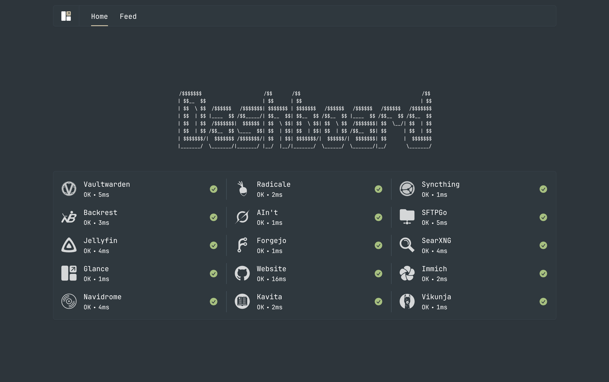
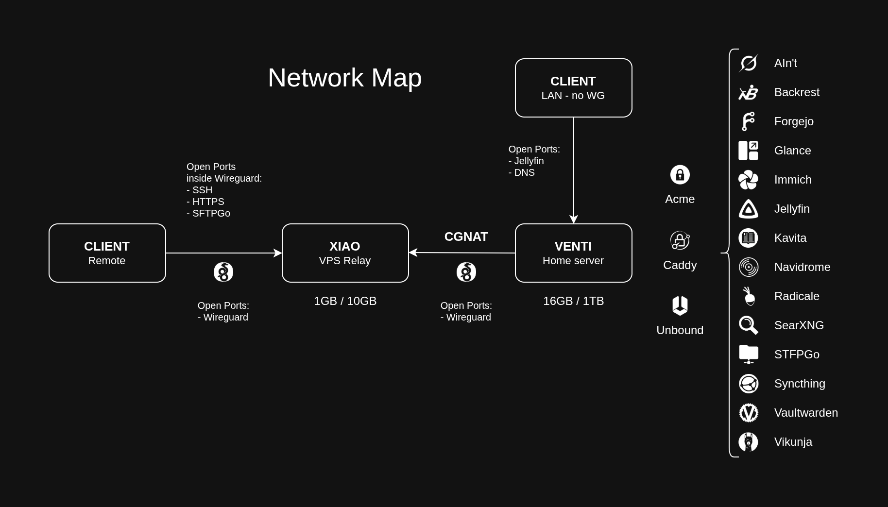

# Ivy - NixOS config

> *Hardened dual-host NixOS home server setup to replace cloud services and break through CGNAT.*





## Features

- Security focused
- Break through CGNAT
- 15 web services to replace the cloud
- Jellyfin, Navidrome, Kavita, Immich, SearXNG
- Forgejo, Vaultwarden, AIn't, Glance, Vikunja
- Backrest, SFTPGo, Syncthing, Radicale
- Zero open ports to internet (except WG)
- Access from anywhere with Wireguard
- Zone-based firewall
- (Incoming) Trust-less VPS relay
- Setup and architecture documentation
- Clean-ish config
- Hardened recursive DNS resolver
- Adblocking in the DNS resolver
- Certificates through DNS-01
- Automated tiered non-duplicated backups
- Role-based host config
- Modular strict service hardening profiles
- Automatic documentation for options
- Self-healing compressed ZFS snapshots
- Impermanence
- LUKS2 disc encryption from anywhere
- Declarative disc setup through Disko
- Remote LUKS decryption
- Anemo boys :3
- SSH rate-limiting through penalties
- Hardware-key restricted SSH
- Secrets management with SOPS
- Home manager config

## Repo Structure

```
├── docs
├── home
│   └── non
├── hosts
│   ├── venti
│   └── xiao
├── modules
│   ├── base
│   ├── networking
│   └── services
└── secrets
    ├── hosts
    ├── services
    └── shared
```

For more information see the documentation in `docs/`
